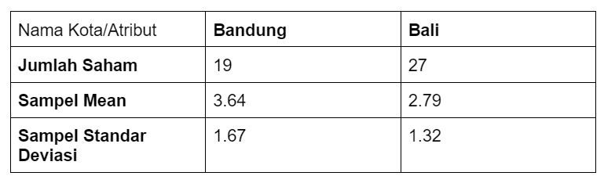
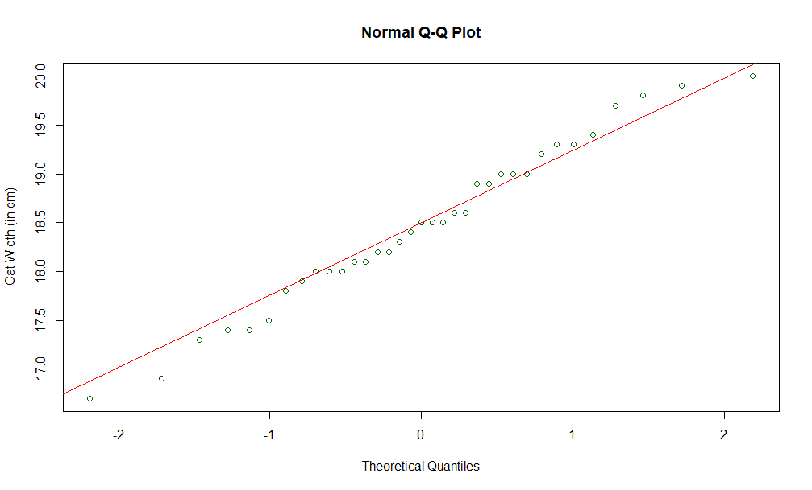
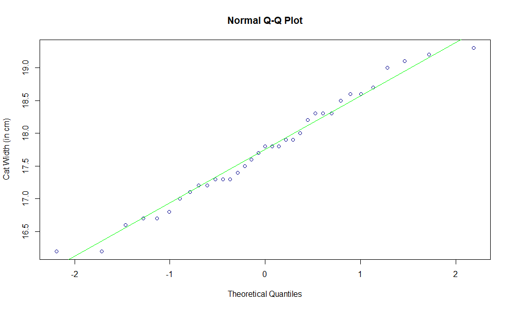
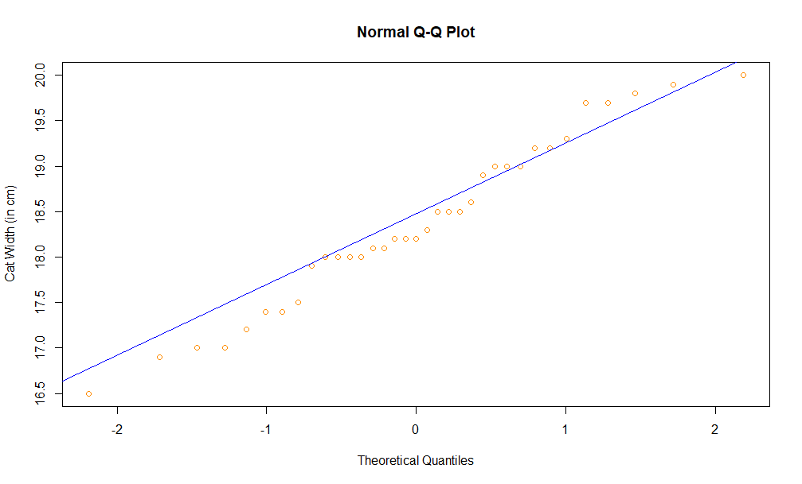
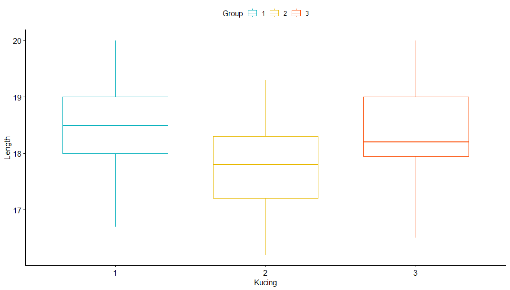
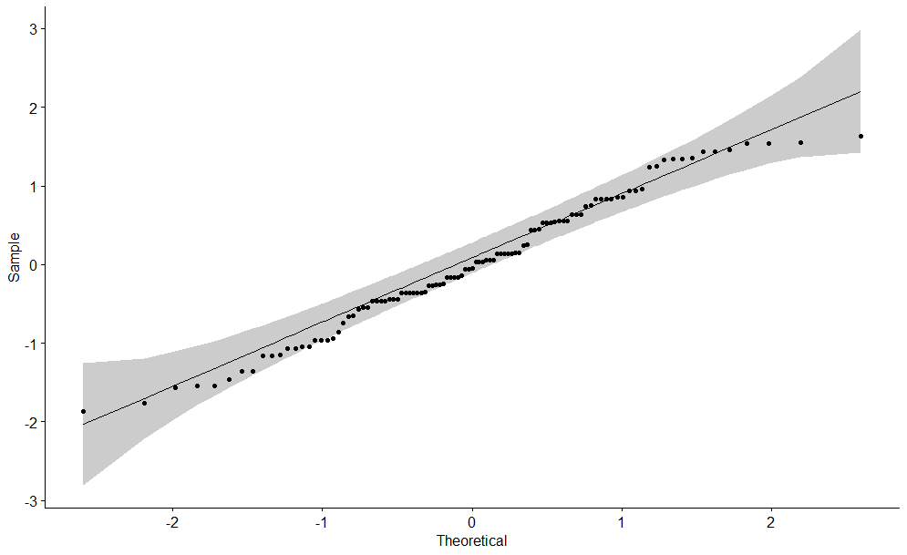
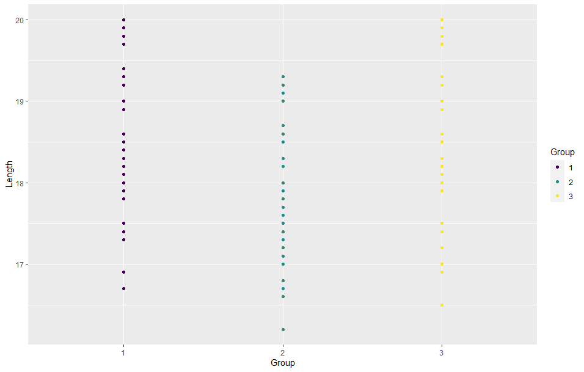

# Praktikum Probabilitas Statistik Modul 2
**<br>Dimas Fadilah Akbar_5025211010**
**<br>Kelas Probstat A**

## Requirement
- R for windows
- RStudio

## Instalasi Library 
- library Rlab
- library dplyr
- library ggplot
- library BSDA 

> pada praktikum ini akan menggunakan fungsi-fungsi yang tersedia pada library Rlab, dplyr, dan ggplot. Untuk itu perlu melakukan instalasi dengan mengetikkan code berikut pada console di RStudio
```r
install.packages("Rlab")
install.packages("dplyr")
install.packages("ggplot2")
install.packages("BSDA")
```

## Soal Nomor 1

### a) Carilah Standar Deviasi dari data selisih pasangan pengamatan tabel diatas!
dalam menyelesaikan persoalan ini kita bisa menghitung standar deviasi dari masing-masing perlakukan yaitu sebelum dan sesudah.
- kita bisa simpan data kita pada dataframe terlebih dahulu

```r
df.data <- data.frame(x = c(78, 75, 67, 77, 70, 72, 78, 74, 77), 
                      y = c(100, 95, 70, 90, 90, 90, 89, 90, 100))
```

- kemudian kita bisa menentukan mean dari masing-masing kondisi A dan B

```r
mean.x <- with(df.data, mean(x))
mean.y <- with(df.data, mean(y, na.rm = T))
```

- kemudian dataframe data tadi bisa kita gabungkan dengan mean dalam satu tabel dengan fungsi rbind (Fungsi rbind() merepresentasikan fungsi pengikat baris untuk vektor, bingkai data, dan matriks untuk diatur sebagai baris. Ini digunakan untuk menggabungkan beberapa bingkai data untuk manipulasi data.)

```r
df.data2 <- rbind(df.data, mean.data
row.names(df.data2)[dim(df.data2)[1]] <- "means"
```

- selanjutnya adalah menentukan standar deviasi A dan B

```r
sd.x <- with(df.data, sd(x, na.rm = T))
sd.y <- with(df.data, sd(y, na.rm = T))
print(paste("standar deviasi sebelum: ", as.character(sd.x)))
print(paste("standar deviasi sebelum: ", as.character(sd.y)))
```

output:

```
"standar deviasi sebelum:  3.86580450158107"
"standar deviasi sebelum:  8.83333333333333"
```

- inputkan standar deviasi dalam dataframe 2 

```r
df.data2 <- rbind(df.data2, sd.data)
row.names(df.data2)[dim(df.data2)[1]] <- "Standard deviation"
df.data2
```

output:

```r
                           x          y
1                  78.000000 100.000000
2                  75.000000  95.000000
3                  67.000000  70.000000
4                  77.000000  90.000000
5                  70.000000  90.000000
6                  72.000000  90.000000
7                  78.000000  89.000000
8                  74.000000  90.000000
9                  77.000000 100.000000
means              74.222222  90.444444
Standard deviation  3.865805   8.833333
```

- hasil selisih dari standar deviasi sesudah dan sebelum adalah
```r
sdeviation <- sd.y-sd.x
sdeviation
```

output:
```
4.967529
```

### b) Carilah nilai t (p-value)
- dalam menentukan nilai t(p-value) kita bisa menggunakan function t.test dengan parameter (x, y, alternative, var.equal)

```r
x = c(78, 75, 67, 77, 70, 72, 78, 74, 77)
y = c(100, 95, 70, 90, 90, 90, 89, 90, 100)
t.test(x, y, alternative = "greater", var.equal =  FALSE)
```

output:

```r
	Welch Two Sample t-test

data:  x and y
t = -5.0473, df = 10.956, p-value = 0.9998
alternative hypothesis: true difference in means is greater than 0
95 percent confidence interval:
 -21.99644       Inf
sample estimates:
mean of x mean of y 
 74.22222  90.44444 
```
### c) tentukanlah apakah terdapat pengaruh yang signifikan secara statistika dalam hal kadar saturasi oksigen , sebelum dan sesudah melakukan aktivitas 𝐴 jika diketahui tingkat signifikansi 𝛼 = 5% serta H0 : “tidak ada pengaruh yang signifikan secara statistika dalam hal kadar saturasi oksigen , sebelum dan sesudah melakukan aktivitas 𝐴”

- dalam menentukan apakah H0 dan H1 diterima kita bisa menentukann p value. apabila p value < signifikan value maka tolak H0 dan sebaliknya terima H1.

```r
## perbandingan x dan y
var.test(x, y)

## menentukan apakah ho diterima atau ditolak, 
t.test(x, y, var.equal = TRUE)
```

output:
```r
	F test to compare two variances

data:  x and y
F = 0.19153, num df = 8, denom df = 8, p-value = 0.03101
alternative hypothesis: true ratio of variances is not equal to 1
95 percent confidence interval:
 0.04320235 0.84909000
sample estimates:
ratio of variances 
         0.1915272 

	Two Sample t-test

data:  x and y
t = -5.0473, df = 16, p-value = 0.000119
alternative hypothesis: true difference in means is not equal to 0
95 percent confidence interval:
 -23.035747  -9.408698
sample estimates:
mean of x mean of y 
 74.22222  90.44444 
```

> dapat disimpulkan bahwa p value kurang dari signifikan value sehingga H0 ditolak

## Soal Nomor 2
> Diketahui bahwa mobil dikemudikan rata-rata lebih dari 20.000 kilometer per tahun. Untuk menguji klaim ini, 100 pemilik mobil yang dipilih secara acak diminta untuk mencatat jarak yang mereka tempuh. Jika sampel acak menunjukkan rata-rata 23.500 kilometer dan standar deviasi 3900 kilometer. (Kerjakan menggunakan library seperti referensi pada modul). 

### a) Apakah Anda setuju dengan klaim tersebut?

```
Setuju
```

### b) Jelaskan maksud dari output yang dihasilkan! 
> diketahui bahwa xbar = 23500, rata-rata populasi = 20000, sd = 3900 dan n = 100
- untuk null hipotesisnya adalah

```
H0: μ <= 20000
```

- untuk alternatif hipotesisnya adalah]

```
H1:  μ > 20000
```

### c)  Buatlah kesimpulan berdasarkan P-Value yang dihasilkan!
- menentukan p-value dan z-score

```r
## menentukan p-value dan juga z-score
xbar = 23500
miu0 = 20000
sd = 3900
n = 100
z <- (xbar-miu0)/(sd/sqrt(n));
p_value = pnorm(z)
print(paste("p-value: ", as.character(p_value)))

significant_val = .05
z.alpha = qnorm(significant_val)
print(paste("z-score: ", as.character(-z.alpha)))
```

output:

```r
"p-value:  1"
"z-score:  1.64485362695147"
```

> kesimpulan: statistik uji-z menurut informasi yang kami miliki dari pernyataan tersebut. kami menggunakan statistik-z karena kami mengetahui rata-rata μ dan standar deviasi σ, juga kami mengetahui bahwa ukuran sampel ≥30. Kemudian, kami menghitung nilai kritis kiri. Sekarang, kita dapat menyimpulkan bahwa uji statistik 8.974359 lebih dari nilai kritis -1.959964. Konsekuensinya, pada tingkat signifikansi 0,05, kita menerima klaim yang berarti sebuah mobil berjarak di atas 20.000 km/tahun.

> Nilai P mendekati 1 menunjukkan tidak ada perbedaan antara kelompok selain karena kebetulan.


## Soal Nomor 3
> Diketahui perusahaan memiliki seorang data analyst ingin memecahkan permasalahan pengambilan keputusan dalam perusahaan tersebut. Selanjutnya didapatkanlah data berikut dari perusahaan saham tersebut.



> Dari data diatas berilah keputusan serta kesimpulan yang didapatkan dari hasil diatas. Asumsikan nilai variancenya sama, apakah ada perbedaan pada rata-ratanya (α= 0.05)? Buatlah :

### a) H0 dan H1
- null hipotesisnya adalah

```r
H0: μ1−μ2=0
```

- alternatif hipotesisnya adalah

```r
H1: μ1−μ2≠0
```

### b) Hitung Sampel Statistik

```r
n_bandung = 19
sd_bandung = 1.67
mean_bandung = 3.64

n_bali = 27
sd_bali = 1.32
mean_bali = 2.79
significant_val = 0.05
delta_0 = 0

z_score <- (mean_bandung - mean_bali - delta_0)/
  sqrt(sd_bandung/n_bandung + sd_bali/n_bali)
print(paste("z_score: ", as.character(z_score)))
p_value = pnorm(z_score)
print(paste("p_value: ", as.character(p_value)))
```

output:

```r
"z_score:  2.29827434938398"
"p_value:  0.989226910296688"
```
> (karena ternyata lebih besar dari tingkat signifikansi 0.05 kami tidak menolak null hipotesis)


### c) Lakukan Uji Statistik (df =2)

```r
p_value = 2*pt(z_score, 2)
print(paste("p_value: ", as.character(p_value)))
```

output:

```r
"p_value:  1.85167636429173"
```

### d) Nilai Kritikal

```r
alpha = 0.05
t.half.alpha = qt(1-alpha/2, df=2)
critical_val = c(-t.half.alpha, t.half.alpha)
print(paste("critical value: ", as.character(critical_val)))
```

output:

```r
[1] "critical value:  -4.30265272974946"
[2] "critical value:  4.30265272974946" 
```

```
(per one tail 0.25 signifikan level)
(per two tail 0.05 signifikan level)
```

### e) Keputusan
> Statistik uji 1,851676 terletak di antara nilai kritis -4,302653 dan 4,302653. Oleh karena itu, pada tingkat signifikansi 0,05, kami tidak menolak hipotesis nol bahwa rata-rata Bandung dan Bali tidak berbeda.

### f) Kesimpulan
> kami menghitung statistik uji-z sesuai dengan informasi yang kami miliki dari Contoh 2. Dalam hal ini, kami menggunakan statistik-z karena kami mengetahui rata-rata μ dan standar deviasi σ uji-z = 2,298274 Kemudian kami menghitung pval untuk menghitung dua ekor p-nilai df statistik Alih-alih menggunakan nilai kritis asumsikan df=2 Karena ternyata lebih besar dari tingkat signifikansi 0,05, kami tidak menolak hipotesis nol Statistik uji 1,851676 terletak di antara nilai kritis -4,302653 dan 4.302653. Oleh karena itu, pada tingkat signifikansi 0,05, kami tidak menolak hipotesis nol bahwa rata-rata Bandung dan Bali tidak berbeda.


## Soal Nomor 4
> Seorang Peneliti sedang meneliti spesies dari kucing di ITS . Dalam penelitiannya ia mengumpulkan data  tiga spesies kucing yaitu kucing oren, kucing hitam dan kucing putih dengan panjangnya masing-masing.  Jika : diketahui dataset https://intip.in/datasetprobstat1 . H0 : Tidak ada perbedaan panjang antara ketiga spesies atau rata-rata panjangnya sama

### a) Buatlah masing masing jenis spesies menjadi  3 subjek "Grup" (grup 1,grup 2,grup 3). Lalu Gambarkan plot kuantil normal untuk setiap kelompok dan lihat apakah ada outlier utama dalam homogenitas varians.

```r
Grup1 <- c(19 ,18.6 ,18.3 ,18 ,18.2 ,18.6 ,18.5 ,18.2 ,18.4 ,18.9 ,19.9 ,18.5 ,16.9 ,18 ,17.3 ,17.8 ,20 ,19 ,19.2 ,18.9 ,17.5 ,18.1 ,18 ,18.1 ,17.4 ,17.9 ,17.4 ,16.7 ,19.7 ,19.3 ,19 ,19.4 ,19.8 ,19.3 ,18.5)
Grup2 <- c(18.3 ,17.9 ,17.6 ,17.3 ,17.5 ,17.9 ,17.8 ,17 ,17.7 ,18.2 ,19.2 ,17.8 ,16.2 ,17.3 ,16.6 ,17.1 ,19.3 ,18.3 ,18.5 ,18 ,16.8 ,17.2 ,17.3 ,17.4 ,16.7 ,17.2 ,16.7 ,16.2 ,19 ,18.6 ,18.3 ,18.7 ,19.1 ,18.6 ,17.8)
Grup3 <- c(18, 18.6, 18.3, 18, 18.2, 18.2, 18.5, 18.2, 19.2, 18.5, 19.9, 18.5, 16.9, 18, 17, 17.2, 20, 19, 19.2, 18.9, 17.5, 18.1, 18, 18.1, 17.4, 17.9, 17.4, 16.5, 19.7, 19, 19, 19.7, 19.8, 19.3, 17)
```

- melakukan plotting untuk Group 1

```r
qqnorm(Grup1, 
       ylab = "Cat Width (in cm)", 
       col = "dark green")
qqline(Grup1, 
       col = "red")
```



- melakukan plotting untuk Group 2

```r
qqnorm(Grup2, 
       ylab = "Cat Width (in cm)", 
       col = "dark blue")
qqline(Grup2, 
       col = "green")
```



- melakukan plotting untuk Group 3

```r
qqnorm(Grup3, 
       ylab = "Cat Width (in cm)", 
       col = "dark orange")
qqline(Grup3, 
       col = "blue")
```



- Plotting ketiga Group untuk persebaran panjang dari masing-masing jenis kucing

```r
my_data <- read.delim(file.choose())
my_data$Group <- ordered(my_data$Group, levels = c("1", "2", "3"))
levels(my_data$Group)
group_by(my_data, Group) %>%
  summarise(
    count = n(),
    mean = mean(Length, na.rm = TRUE),
    sd = sd(Length, na.rm = TRUE)
  )
ggboxplot(my_data, x = "Group", y="Length",
          color = "Group", palette = c("#00AFBB", "#E7B800", "#FC4E07"),
          order = c("1", "2", "3"),
          ylab = "Length", xlab = "Kucing")
```



> Kesimpulan 4a: Tidak ada outlier ekstrim


### b) carilah atau periksalah Homogeneity of variances nya , Berapa nilai p yang didapatkan? , Apa hipotesis dan kesimpulan yang dapat diambil ?

```r
leveneTest(Length ~ Group, data = my_data)
```

output:

```r
Levene's Test for Homogeneity of Variance (center = median)
       Df F value Pr(>F)
group   2  0.1702 0.8438
      102       
```

> Dari output di atas terlihat bahwa p-value tidak kurang dari taraf signifikansi 0,05. Ini berarti bahwa tidak ada bukti yang menunjukkan bahwa varian antar kelompok berbeda secara signifikan secara statistik. Oleh karena itu, dapat diasumsikan tidak ada homogenitas varian pada kelompok perlakuan yang berbeda.


### c) Untuk uji ANOVA, buatlah model linier dengan Panjang versus Grup dan beri nama model tersebut model 1.

```r
model <- lm(Length ~ Group, data = my_data)
ggqqplot(residuals(model))
```

output:




### d) Dari Hasil Poin C , Berapakah nilai-p ? ,  Apa yang dapat Anda simpulkan dari H0?

```r
shapiro.test(residuals(model))
```

output:

```r
	Shapiro-Wilk normality test

data:  residuals(model)
W = 0.98017, p-value = 0.1176
```

> Kesimpulan di atas didukung oleh uji Shapiro-Wilk pada residu ANOVA (W = 0,98017, p = 0,1176) yang tidak menemukan indikasi bahwa normalitas dilanggar


### e) Verifikasilah jawaban model 1 dengan Post-hooc test TukeyHSD ,  dari nilai p yang didapatkan apakah satu jenis kucing lebih panjang dari yang lain? Jelaskan.

```r
submodel <- aov(Length ~ Group, data = my_data)
summary(submodel)
```

output:

```r
             Df Sum Sq Mean Sq F value Pr(>F)   
Group         2  10.61   5.307   7.098 0.0013 **
Residuals   102  76.27   0.748                  
---
Signif. codes:  0 ‘***’ 0.001 ‘**’ 0.01 ‘*’ 0.05 ‘.’ 0.1 ‘ ’ 1
```

> Nilai p yang diamati dari tabel ANOVA kurang dari 0,05, menunjukkan bahwa ada cukup bukti untuk menyimpulkan bahwa rerata kelompok tidak sama

### f) Visualisasikan data dengan ggplot2

```r
ggplot(my_data, aes(Group, Length, colour=Group)) + geom_point()
```

output:




